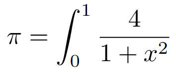
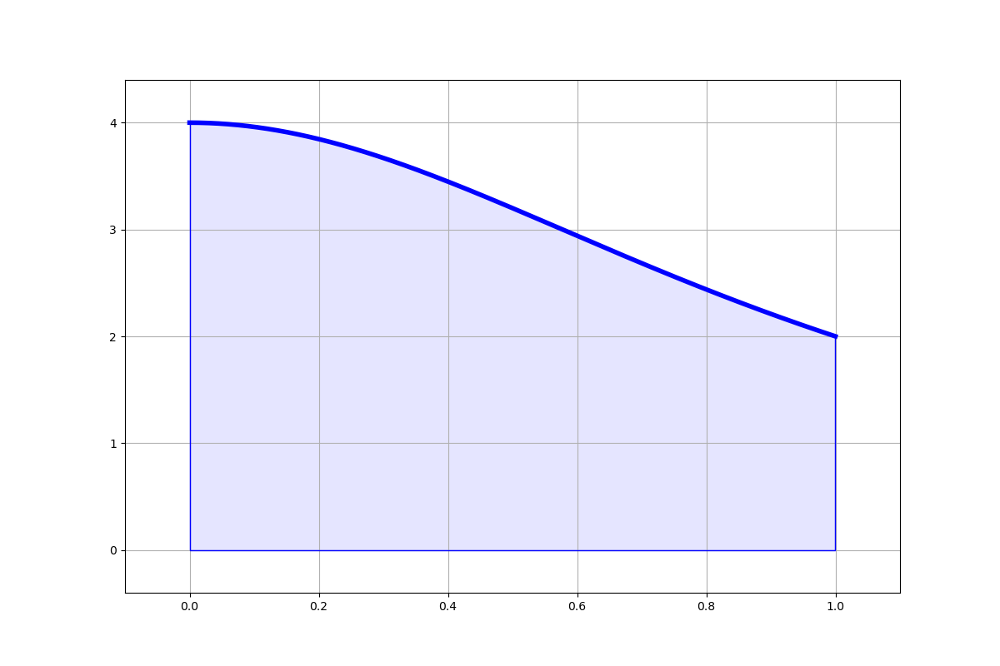
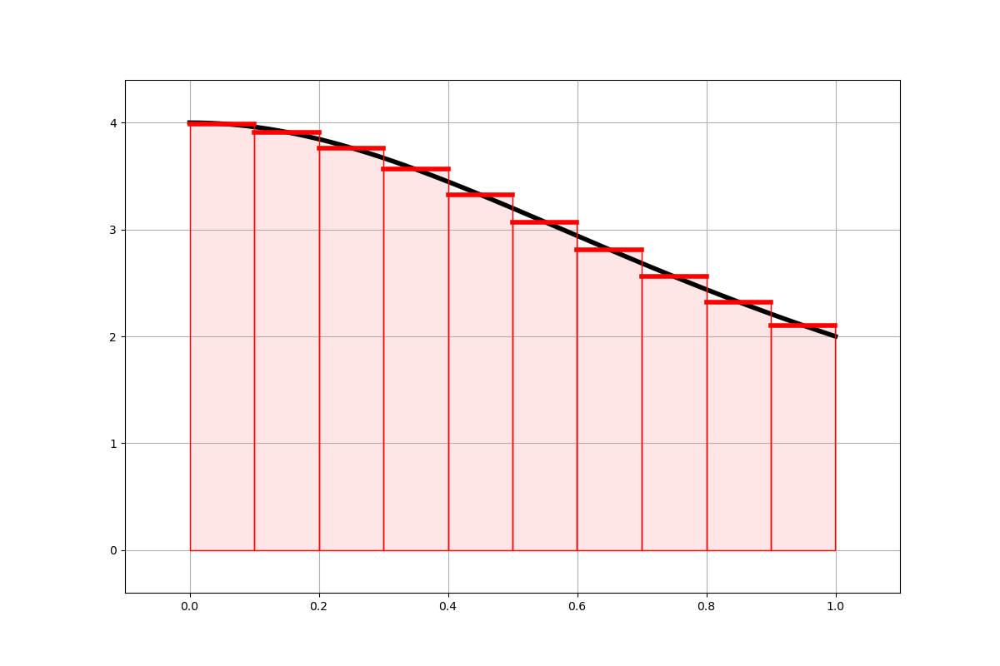

# pi_calc_parallel

The common function of all the codes is to estimate the mathematical constant $\pi$.

It holds, that

That is, the area under the curve on the below picture is exactly equal to $\pi$.

We can estimate the area using the following algorithm. Cut the x-axis into several intervals, replace the curve on each interval with a simple line, calculate the area of the created rectangles, and add the areas of all rectangles together, as shown in the picture below.

The main point here is, that this algorithm can be easily parallelized. The codes in this repository show how this can be parallelized using multiple parallelization techniques.

QR code leading to this repository:

---

my notes, feel free to ignore:

ml OpenMPI/5.0.5-NVHPC-24.3-CUDA-12.3.0 Python/3.10.8-GCCcore-12.2.0

mpi4py mam nainstalovane rucne pres pip

export OMP_PLACES=cores

export OMP_PROC_BIND=close

export OMP_NUM_THREADS=16

mpirun -n 4 --map-by ppr:1:numa --bind-to numa ./program.x
